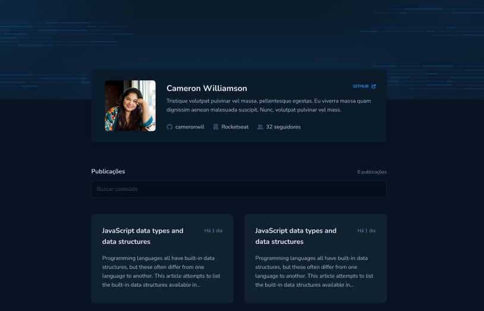

# GitHub Blog

Projeto desenvolvido durante a live na Twitch do Biro juntamente com o Joseph da Rocketseat.

## Demonstração do projeto

   

## O que foi realizado no projeto
* Criação da página web.
* Deploy utilizando a Vercel.
* Link que redireciona para o repositório no GitHub.

## Tecnologias utilizadas
* NextJS
* Stitches

## Rodando a aplicação

* yarn dev

